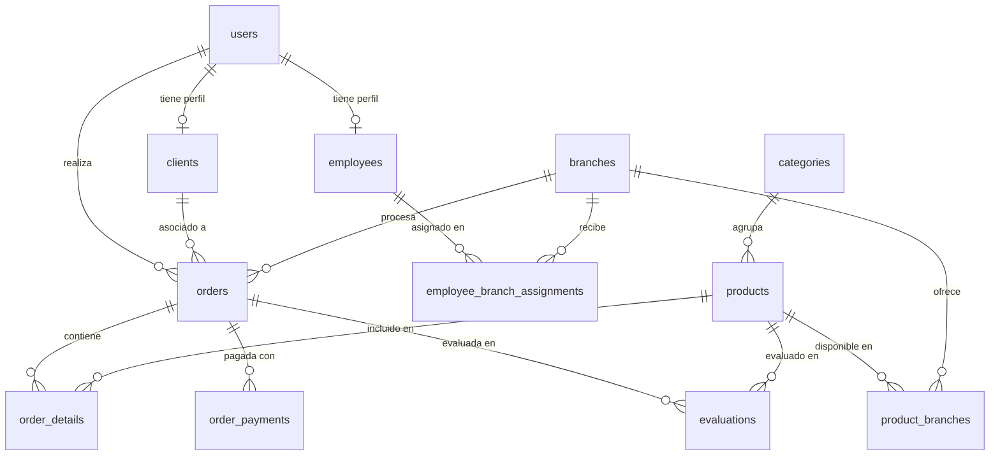

# Arquitectura de Resources (Refine SPA + Laravel API REST)

> **Objetivo:** que cualquier persona pueda entender el flujo completo de un módulo CRUD **desde la interfaz del usuario hasta la base de datos**, pasando por rutas SPA, Refine, controladores, modelos, validaciones, migraciones y relaciones.
>
> Esta guía **no profundiza** en las pantallas `list`, `create`, `edit` y `show` — cada una tiene su documentación dedicada. Aquí se explica el **sistema completo** que las conecta.

---

## Qué significa "Resource" en este proyecto

La palabra *Resource* aparece en **tres capas distintas**. Conocer la diferencia evita confusiones:

| Capa | Qué es | Dónde vive | Ejemplo |
| :--- | :--- | :--- | :--- |
| **Refine Resource** | Entidad CRUD del frontend: nombre, rutas SPA y metadatos del menú | `resources/js/AppRouter.tsx` | `{ name: "branches", list: "/branches", ... }` |
| **Laravel API Resource** | Endpoints REST generados por `Route::apiResource()` | `routes/api.php` → Controlador | `GET /api/branches` → `BranchController@index` |
| **Laravel JsonResource** | Clase que transforma un modelo Eloquent a JSON enriquecido (labels, columnas, filtros) | `app/Http/Resources/` | `BranchResource::tableColumns()` |

Relación canónica entre capas:

```text
Refine Resource (name="branches")
        ↕  dataProvider simple-rest
Laravel apiResource('branches')
        ↕  Eloquent
Tabla `branches` en MySQL/SQLite
```

---

## Vista general del sistema

La aplicación es una **SPA (Single Page Application)**. Laravel sirve una vista Blade vacía (`routes/web.php`) y React Router + Refine manejan toda la navegación del panel administrativo.

```text
┌─────────────────────────────────────────────────────────────────────────┐
│  NAVEGADOR                                                              │
│  URL: /branches, /products/create, /orders/show/5, etc.                 │
└───────────────────────────────┬─────────────────────────────────────────┘
                                │
┌───────────────────────────────▼─────────────────────────────────────────┐
│  FRONTEND (React 19 + Refine + Ant Design)                              │
│  AppRouter.tsx                                                          │
│    • resources[]  → menú lateral + nombre para dataProvider             │
│    • Routes       → componente de página (list/create/edit/show)        │
│    • dataProvider → @refinedev/simple-rest sobre /api                     │
│    • authProvider → Sanctum Bearer Token (localStorage)                 │
└───────────────────────────────┬─────────────────────────────────────────┘
                                │ HTTP JSON (Axios + Authorization header)
┌───────────────────────────────▼─────────────────────────────────────────┐
│  BACKEND (Laravel 12 + Sanctum)                                         │
│  routes/api.php                                                         │
│    • POST /login, /register  (públicas)                                 │
│    • auth:sanctum            (protegidas)                               │
│    • Route::apiResource()    → Controlador@index|store|show|update|destroy│
│  Controlador                                                            │
│    • Consulta/filtro Eloquent                                           │
│    • Validación con Model::rules() / Model::messages()                  │
│    • Lógica de negocio (Services, transacciones)                        │
│    • Respuesta JSON + header x-total-count                              │
└───────────────────────────────┬─────────────────────────────────────────┘
                                │ Eloquent ORM
┌───────────────────────────────▼─────────────────────────────────────────┐
│  BASE DE DATOS                                                          │
│  Migraciones en database/migrations/                                    │
│  Tablas: users, branches, products, orders, ...                         │
└─────────────────────────────────────────────────────────────────────────┘
```

### Flujo de autenticación (prerequisito de todo CRUD)

Antes de consumir cualquier resource protegido, el usuario debe autenticarse:

```text
[1] Usuario → /login → CustomLogin
[2] authProvider.login → POST /api/login
[3] ApiAuthController valida credenciales → crea token Sanctum
[4] Frontend guarda auth_token y user en localStorage
[5] Interceptor Axios agrega: Authorization: Bearer <token>
[6] Todas las peticiones CRUD pasan middleware auth:sanctum
```

Detalle del `authProvider` y rutas públicas/protegidas: [`documentations/AppRouter-doc.md`](./AppRouter-doc.md).

---

## Inventario de Resources del sistema

### Menú jerárquico (Refine)

Los resources se agrupan en el menú lateral mediante `meta.parent`. Los padres (`personas`, `tiendas`, `productos`, `pagos`) son **solo contenedores de menú** — no tienen rutas ni endpoints propios.

```text
Dashboard
Personas
  ├── users          (Usuarios)
  ├── clients        (Clientes)
  └── employees      (Empleados)
Tiendas
  ├── branches       (Sucursales)
  └── evaluations    (Evaluaciones)
Productos
  ├── products       (Productos)
  └── categories     (Categorías)
Pagos
  ├── orders         (Órdenes)
  ├── order-details  (Detalles de Órdenes)
  ├── order-payments (Pagos de Órdenes)
  ├── payment-methods (Métodos de Pago — solo list/show)
  └── banks          (Bancos — solo list/show)
```

### Tabla completa: frontend ↔ API ↔ persistencia

| Refine `name` | Ruta SPA base | Endpoint API | Controlador | Modelo / Origen de datos | Tipo |
| :--- | :--- | :--- | :--- | :--- | :--- |
| `users` | `/users` | `/api/users` | `UserController` | `User` | CRUD completo |
| `clients` | `/clients` | `/api/clients` | `ClientController` | `Client` | CRUD completo |
| `employees` | `/employees` | `/api/employees` | `EmployeeController` | `Employee` + `EmployeeBranchAssignment` | CRUD + asignaciones |
| `branches` | `/branches` | `/api/branches` | `BranchController` | `Branch` | CRUD completo |
| `evaluations` | `/evaluations` | `/api/evaluations` | `EvaluationController` | `Evaluation` | CRUD completo |
| `products` | `/products` | `/api/products` | `ProductController` | `Product` | CRUD completo |
| `categories` | `/categories` | `/api/categories` | `CategoryController` | `Category` | CRUD completo |
| `orders` | `/orders` | `/api/orders` | `OrderController` | `Order` | CRUD completo |
| `order-details` | `/order-details` | `/api/order-details` | `OrderDetailController` | `OrderDetail` | CRUD completo |
| `order-payments` | `/order-payments` | `/api/order-payments` | `OrderPaymentController` | `OrderPayment` | CRUD completo |
| `payment-methods` | `/payment-methods` | `/api/payment-methods` | `PaymentMethodController` | `App\Enums\PaymentMethod` | Catálogo estático |
| `banks` | `/banks` | `/api/banks` | `BankController` | `App\Enums\Banks` | Catálogo estático |

### Rutas adicionales (fuera de apiResource)

Algunos módulos exponen endpoints especiales para lógica de negocio que no encaja en el CRUD estándar:

| Método | Ruta | Controlador | Propósito |
| :--- | :--- | :--- | :--- |
| `POST` | `/api/employees/validate-assignment` | `EmployeeController@validateAssignment` | Validar asignación de empleado a sucursal antes de guardar |

---

## Capa 1: Frontend — registro y enrutamiento

Archivo central: `resources/js/AppRouter.tsx`.

### 1.1. Registro en Refine (`resources[]`)

Cada entrada del arreglo `resources` declara:

- **`name`**: identificador canónico. Refine lo usa para construir URLs de API (`/api/{name}`) y resolver hooks (`useTable`, `useForm`, `useShow`).
- **`list` / `create` / `edit` / `show`**: rutas SPA de React Router.
- **`meta`**: etiqueta del menú, ícono, `parent` para jerarquía, `canDelete` para habilitar/deshabilitar eliminación.

Ejemplo real (sucursales):

```ts
{
    name: 'branches',
    list: '/branches',
    create: '/branches/create',
    edit: '/branches/edit/:id',
    show: '/branches/show/:id',
    meta: {
        label: 'Sucursales',
        parent: 'tiendas',
        canDelete: true,
        icon: <BranchesOutlined />,
    },
},
```

### 1.2. Rutas de React Router (`<Routes>`)

Además del registro en Refine, cada resource necesita rutas explícitas que mapean URL → componente de página:

```text
/branches          → BranchesList
/branches/create   → BranchesCreate  (carga diferida con React.lazy)
/branches/edit/:id → BranchesEdit
/branches/show/:id → BranchesShow
```

> **Nota:** el módulo `branches` usa `React.lazy` + `Suspense` para dividir el bundle. El patrón es el mismo para todos los resources; solo cambia si se aplica o no lazy loading.

### 1.3. Data Provider y contrato HTTP

```ts
const API_URL = '/api';
dataProvider={dataProvider(API_URL, axiosInstance)}
```

Refine (`@refinedev/simple-rest`) traduce operaciones CRUD a peticiones HTTP:

| Operación Refine | Método HTTP | URL ejemplo |
| :--- | :--- | :--- |
| `getList` | `GET` | `/api/branches?_start=0&_end=10&_sort=name&_order=asc` |
| `getOne` | `GET` | `/api/branches/3` |
| `create` | `POST` | `/api/branches` |
| `update` | `PUT` | `/api/branches/3` |
| `delete` | `DELETE` | `/api/branches/3` |

El interceptor de Axios inyecta el token Sanctum en cada petición.

### 1.4. Documentación de pantallas (referencia cruzada)

| Vista | Documento |
| :--- | :--- |
| Listado | [`documentations/list-doc.md`](./list-doc.md) |
| Crear | [`documentations/create-doc.md`](./create-doc.md) |
| Editar | [`documentations/edit-doc.md`](./edit-doc.md) |
| Detalle | [`documentations/show-doc.md`](./show-doc.md) |
| AppRouter completo | [`documentations/AppRouter-doc.md`](./AppRouter-doc.md) |

---

## Capa 2: Backend — rutas y controladores

### 2.1. Registro de rutas API

Archivo: `routes/api.php`.

```php
// Públicas
Route::post('/login', [ApiAuthController::class, 'login']);
Route::post('/register', [ApiAuthController::class, 'register']);

// Protegidas (requieren Bearer Token)
Route::middleware('auth:sanctum')->group(function () {
    Route::apiResource('users', UserController::class);
    Route::apiResource('branches', BranchController::class);
    // ... resto de resources
});
```

`Route::apiResource()` genera automáticamente estas rutas:

| Método | URI | Acción del controlador | Uso en Refine |
| :--- | :--- | :--- | :--- |
| `GET` | `/api/{resource}` | `index` | `getList` |
| `POST` | `/api/{resource}` | `store` | `create` |
| `GET` | `/api/{resource}/{id}` | `show` | `getOne` |
| `PUT/PATCH` | `/api/{resource}/{id}` | `update` | `update` |
| `DELETE` | `/api/{resource}/{id}` | `destroy` | `deleteOne` |

Laravel resuelve `{id}` mediante **Route Model Binding**: el parámetro de ruta se convierte automáticamente en una instancia del modelo (`Branch $branch`).

### 2.2. Patrón estándar de un controlador

Todos los controladores CRUD siguen la misma estructura de responsabilidades:

```text
index()   → Construir query Eloquent → filtros → orden → paginación → JSON + x-total-count
store()   → Validar → preprocesar → crear registro → JSON 201
show()    → Cargar relaciones → JSON del registro
update()  → Validar (modo edición) → preprocesar → actualizar → JSON 200
destroy() → Eliminar → respuesta 204 vacía
```

#### Ejemplo de flujo `index` (común a todos los controladores)

```text
[1] Request llega con query params (_start, _end, _sort, _order, filtros)
[2] $query = Modelo::query() [+ with('relaciones') si aplica]
[3] Aplicar búsqueda: search o q
[4] Aplicar filtros específicos del módulo (status, category_id, branch_id, etc.)
[5] Resolver ordenamiento (_sort/_order o sort_by/sort_order)
[6] $total = $query->count()
[7] $registros = $query->offset($start)->limit($end - $start)->get()
[8] return response()->json($data)->header('x-total-count', $total)
```

#### Ejemplo de flujo `store` / `update`

```text
[1] Request con body JSON (o multipart si hay archivos)
[2] Preprocesamiento opcional (normalizar horas, booleanos, imágenes base64)
[3] $request->validate(Modelo::rules($isUpdate), Modelo::messages())
[4] Lógica de negocio adicional (Services, transacciones DB, relaciones)
[5] Modelo::create() o $modelo->update()
[6] Respuesta JSON con el registro (a veces transformado por JsonResource)
```

### 2.3. Dos variantes de respuesta JSON

El proyecto usa dos estrategias según la complejidad del módulo:

| Estrategia | Cuándo se usa | Ejemplo |
| :--- | :--- | :--- |
| **Modelo Eloquent directo** | Datos simples, el frontend consume campos tal cual | `BranchController`, `UserController` |
| **Laravel JsonResource** | Se necesitan campos calculados, labels en español, datos de relaciones | `ClientController`, `EmployeeController` |

Con JsonResource:

```php
$data = $clients->map(fn (Client $client) => (new ClientResource($client))->resolve($request));
return response()->json($data)->header('x-total-count', $total);
```

### 2.4. Resources de catálogo estático (sin tabla propia)

`banks` y `payment-methods` **no tienen migración ni modelo Eloquent**. Sus datos viven en Enums de PHP:

- `App\Enums\Banks`
- `App\Enums\PaymentMethod`

El controlador filtra, ordena y pagina una colección en memoria. Solo permiten:

- `index` — listar
- `show` — ver detalle
- `update` — cambiar estado `active` (persistido en caché vía `CatalogActiveRegistry`)

`store` y `destroy` responden **405 Method Not Allowed**.

En el frontend, estos resources tienen `canDelete: false` y no declaran rutas `create` ni `edit`.

---

## Capa 3: Laravel JsonResource (`app/Http/Resources/`)

Además del concepto Refine/Laravel API, existe la clase **`JsonResource`** de Laravel. En este proyecto cumple un rol de **capa de presentación API**:

| Método estático / instancia | Responsabilidad |
| :--- | :--- |
| `toArray()` | Transforma el modelo a JSON enriquecido (labels, fechas formateadas, campos calculados) |
| `tableColumns()` | Define columnas de la tabla del listado (key, label, sortable, visible) |
| `filterFields()` | Define filtros disponibles en el listado (name, type, options) |
| `formFields()` | Define campos del formulario create/edit (type, validation, grid_cols, options) |

Archivos existentes:

```text
app/Http/Resources/
  ├── UserResource.php
  ├── ClientResource.php
  ├── EmployeeResource.php
  ├── BranchResource.php
  ├── CategoryResource.php
  ├── ProductResource.php
  ├── EvaluationResource.php
  ├── OrderResource.php
  ├── OrderDetailResource.php
  └── OrderPaymentResource.php
```

> Los métodos `getFormConfig()` y `getTableConfig()` existen en varios controladores (`UserController`, `ProductController`, `EmployeeController`, etc.) como punto de extensión para exponer la configuración de UI desde el backend. Actualmente el frontend define sus columnas y formularios directamente en las páginas; estos endpoints están preparados para una futura centralización.

---

## Capa 4: Modelos Eloquent (`app/Models/`)

Cada tabla de base de datos tiene su modelo. El modelo es la **fuente de verdad** para:

### 4.1. Atributos y asignación masiva

```php
protected $fillable = ['name', 'address', 'city', ...];  // campos que acepta create()/update()
protected $guarded = ['id'];                                // campos protegidos
protected $casts = ['active' => 'boolean', 'opening_date' => 'date', ...];
```

### 4.2. Validación centralizada

Cada modelo expone reglas reutilizables:

```php
// Crear
$request->validate(Branch::rules(), Branch::messages());

// Editar (reglas pueden variar, p. ej. email único excepto el actual)
$request->validate(Branch::rules(true), Branch::messages());
```

- **`rules(bool $isUpdate = false)`**: reglas de validación Laravel.
- **`messages()`**: mensajes de error en español.

Esto garantiza que la misma validación se aplique desde cualquier punto de entrada (controlador, futuros jobs, tests).

### 4.3. Scopes de consulta

Los modelos definen scopes reutilizables para filtros comunes:

```php
Branch::query()->search($term)->active()->byCity('Caracas');
Client::query()->search($term)->where('status', 'active');
Employee::query()->search($term)->whereHas('assignments', ...);
```

Los controladores invocan estos scopes dentro de `index()` en lugar de repetir lógica SQL.

### 4.4. Relaciones entre entidades



Relaciones clave del dominio:

- **Usuario → Cliente/Empleado:** al crear un `User` con rol `client` o `employee`, `UserController` crea automáticamente el perfil vinculado (`createRelatedProfile`).
- **Empleado → Sucursal:** tabla pivote `employee_branch_assignments` con posición (`EmployeePosition` enum) y fechas.
- **Producto → Sucursal:** tabla pivote `product_branches` con precio especial y disponibilidad.
- **Orden:** vincula `user_id`, `client_id`, `branch_id` y `assigned_employee_id`. El trait `NormalizesOrderClientLinks` mantiene coherencia entre usuario y cliente del restaurante.

---

## Capa 5: Migraciones (`database/migrations/`)

Las migraciones definen el esquema de base de datos. Son el **punto de partida** de cualquier resource nuevo.

### Convenciones del proyecto

- Comentarios en columnas (`->comment('...')`) para documentar el propósito de cada campo.
- `foreignId()->constrained()->nullOnDelete()` para relaciones con eliminación segura.
- Enums de dominio referenciados desde `App\Enums\*` (ej. `PaymentCurrency::values()` en migración de órdenes).
- Índices compuestos en tablas de alto volumen (`orders`, `order_details`).

### Migraciones existentes

| Archivo | Tabla | Resource asociado |
| :--- | :--- | :--- |
| `0001_01_01_000000_create_users_table.php` | `users` | `users` |
| `2025_11_25_155608_create_branches_table.php` | `branches` | `branches` |
| `2025_11_14_230943_create_categories_table.php` | `categories` | `categories` |
| `2025_11_14_230944_create_products_table.php` | `products` | `products` |
| `2025_11_25_163839_create_product_branches_table.php` | `product_branches` | (pivote products ↔ branches) |
| `2025_11_26_100000_create_employees_table.php` | `employees` | `employees` |
| `2025_11_26_100100_create_employee_branch_assignments_table.php` | `employee_branch_assignments` | (pivote employees ↔ branches) |
| `2025_11_26_100200_create_clients_table.php` | `clients` | `clients` |
| `2025_11_26_100300_create_orders_table.php` | `orders` | `orders` |
| `2025_11_26_100400_create_order_details_table.php` | `order_details` | `order-details` |
| `2025_11_26_100500_create_order_payments_table.php` | `order_payments` | `order-payments` |
| `2025_11_26_100600_create_evaluations_table.php` | `evaluations` | `evaluations` |

---

## Capa 6: Lógica de negocio transversal

Cuando la lógica supera lo que cabe en un controlador, el proyecto la extrae a:

### 6.1. Services (`app/Services/`)

| Servicio | Usado por | Responsabilidad |
| :--- | :--- | :--- |
| `EmployeeAssignmentValidator` | `EmployeeController` | Validar que un empleado no tenga asignaciones conflictivas (gerente general, gerente de sucursal) |
| `ClientOrderResolverService` | `OrderController` | Resolver vínculo entre usuario del sistema y cliente del restaurante en órdenes |
| `ClientPurchaseStatsService` | Vistas de cliente | Estadísticas de compras de un cliente |

### 6.2. Concerns (`app/Http/Concerns/`)

| Trait | Usado por | Responsabilidad |
| :--- | :--- | :--- |
| `NormalizesOrderClientLinks` | `OrderController` | Sincronizar `user_id` y `client_id` de forma coherente al crear/editar órdenes |

### 6.3. Enums (`app/Enums/`)

Centralizan valores constantes del dominio con métodos auxiliares:

| Enum | Uso |
| :--- | :--- |
| `ClientOrigin` | Origen del cliente (online, presencial, etc.) |
| `EmployeePosition` | Posiciones de empleado en sucursal |
| `PaymentCurrency` | Monedas aceptadas en órdenes |
| `PaymentMethod` | Catálogo estático de métodos de pago |
| `PaymentStatus` | Estados de un pago |
| `Banks` | Catálogo estático de bancos |
| `PhoneAreaCode` | Patrón de validación de teléfonos venezolanos |
| `PersonStatus` | Estados de persona (activo/inactivo) |

### 6.4. Soporte de catálogos (`app/Support/CatalogActiveRegistry.php`)

Para `banks` y `payment-methods`, el estado `active` de cada ítem se persiste en **caché de Laravel** (no en base de datos). `CatalogActiveRegistry::setActive()` guarda qué códigos están inactivos.

---

## Contrato API: simple-rest ↔ Laravel

### Query params estándar (enviados por Refine)

| Parámetro | Propósito | Ejemplo |
| :--- | :--- | :--- |
| `_start` | Offset de paginación | `0` |
| `_end` | Límite exclusivo | `10` (devuelve 10 registros: 0–9) |
| `_sort` | Campo de ordenamiento | `name` |
| `_order` | Dirección | `asc` o `desc` |
| `q` / `search` | Búsqueda general | `caracas` |

Además, cada controlador acepta **filtros propios** del módulo (`status`, `role`, `category_id`, `branch_id`, `active`, etc.).

### Header obligatorio de paginación

```text
x-total-count: <total_de_registros_sin_paginar>
```

Sin este header, Refine no puede calcular el número de páginas.

### Códigos de respuesta HTTP

| Código | Cuándo |
| :--- | :--- |
| `200` | Lectura o actualización exitosa |
| `201` | Creación exitosa |
| `204` | Eliminación exitosa (body vacío) |
| `401` | Token inválido o ausente → `authProvider.onError` desloguea |
| `404` | Registro no encontrado (Route Model Binding) |
| `405` | Operación no permitida (catálogos estáticos) |
| `422` | Error de validación → Refine muestra errores en el formulario |

---

## Flujo completo de punta a punta (ejemplo: crear una sucursal)

Este ejemplo ilustra cómo todas las capas interactúan. Los detalles del formulario están en [`create-doc.md`](./create-doc.md).

```text
[1] UI: Admin navega a /branches/create
    → React Router renderiza BranchesCreate

[2] UI: Admin llena formulario y presiona "Guardar"
    → useForm() recolecta valores
    → dataProvider.create("branches", { data: { name, address, city, ... } })

[3] HTTP: POST /api/branches
    → Header: Authorization: Bearer <token>
    → Body: JSON con campos del formulario

[4] Laravel: routes/api.php
    → Middleware auth:sanctum valida token
    → Route::apiResource resuelve → BranchController@store

[5] Controlador: BranchController@store
    → Preprocesa horas (09:00 → 09:00:00)
    → $request->validate(Branch::rules(), Branch::messages())
    → Convierte strings a boolean (is_main, has_delivery, active)
    → Establece creation_date y update_date
    → Branch::create($validated)

[6] Eloquent: INSERT INTO branches (name, address, city, ...)
    → Campos definidos en migración 2025_11_25_155608_create_branches_table.php
    → fillable del modelo Branch controla asignación masiva

[7] Respuesta: HTTP 201 + JSON del branch creado
    → Refine redirige al listado o muestra notificación de éxito
```

---

## Flujo con lógica compleja (ejemplo: crear un empleado con asignaciones)

Algunos resources tienen pasos adicionales que ilustran la arquitectura completa:

```text
[1] POST /api/employees con body que incluye assignments[]

[2] EmployeeController@store
    → Valida con Employee::rules()
    → Extrae assignments del validated
    → EmployeeAssignmentValidator::validate() verifica reglas de negocio
      (un solo gerente general activo por sucursal, etc.)

[3] DB::transaction
    → Employee::create($validated)
    → syncAssignments(): borra asignaciones previas, crea nuevas en
      employee_branch_assignments

[4] Respuesta: EmployeeResource transformado con relaciones
    (user, assignments.branch) → JSON 201
```

Validación previa sin guardar: `POST /api/employees/validate-assignment`.

---

## Cómo crear un nuevo Resource (checklist)

### Tipo A: Resource con base de datos (CRUD completo)

```text
1. MIGRACIÓN
   database/migrations/xxxx_create_<tabla>_table.php
   → Definir columnas, FKs, índices, comentarios

2. MODELO
   app/Models/<Modelo>.php
   → $fillable, $casts, relaciones, scopes, rules(), messages()

3. JSON RESOURCE (recomendado)
   app/Http/Resources/<Modelo>Resource.php
   → toArray(), tableColumns(), filterFields(), formFields()

4. CONTROLADOR
   app/Http/Controllers/<Modelo>Controller.php
   → index, store, show, update, destroy
   → Patrón: query + filtros + paginación + validación + respuesta JSON

5. RUTA API
   routes/api.php → Route::apiResource('<nombre>', <Controller>::class)
   → Dentro del grupo auth:sanctum

6. REFINE RESOURCE
   resources/js/AppRouter.tsx
   → Agregar entrada en resources[] con name, rutas y meta
   → Agregar <Route> para list/create/edit/show

7. PÁGINAS SPA
   resources/js/pages/<nombre>/{list,create,edit,show}.tsx
   → Ver documentación específica de cada vista
```

### Tipo B: Resource de catálogo estático (solo lectura + toggle active)

```text
1. ENUM
   app/Enums/<Nombre>.php con toArrayList(), tryFromIdentifier()

2. CONTROLADOR
   → index/show/update(active) sobre colección en memoria
   → store/destroy → 405

3. REGISTRO EN REFINE
   → Solo list y show, canDelete: false
```

### Convención de nombres

| Elemento | Convención | Ejemplo |
| :--- | :--- | :--- |
| Refine `name` | plural, kebab-case | `order-details` |
| Ruta API | igual al `name` | `/api/order-details` |
| Controlador | PascalCase singular + Controller | `OrderDetailController` |
| Modelo | PascalCase singular | `OrderDetail` |
| Tabla | snake_case plural | `order_details` |
| Carpeta páginas | igual al `name` | `pages/order-details/` |

---

## Lecturas recomendadas

### Documentación interna

- [`AppRouter-doc.md`](./AppRouter-doc.md) — Autenticación, providers y menú
- [`list-doc.md`](./list-doc.md) — Pantalla de listado
- [`create-doc.md`](./create-doc.md) — Pantalla de creación
- [`edit-doc.md`](./edit-doc.md) — Pantalla de edición
- [`show-doc.md`](./show-doc.md) — Pantalla de detalle
- [`tech_stack_inventory.md`](./tech_stack_inventory.md) — Versiones de tecnologías

### Documentación oficial

- [Refine — Resources](https://refine.dev/docs/core/refine-component/#resources)
- [Refine — simple-rest data provider](https://refine.dev/docs/data/packages/simple-rest/)
- [Laravel 12 — Routing (API Resources)](https://laravel.com/docs/routing#api-resource-routes)
- [Laravel 12 — Eloquent](https://laravel.com/docs/eloquent)
- [Laravel 12 — Validation](https://laravel.com/docs/validation)
- [Laravel 12 — Eloquent API Resources](https://laravel.com/docs/eloquent-resources)
- [Laravel 12 — Sanctum](https://laravel.com/docs/sanctum)
