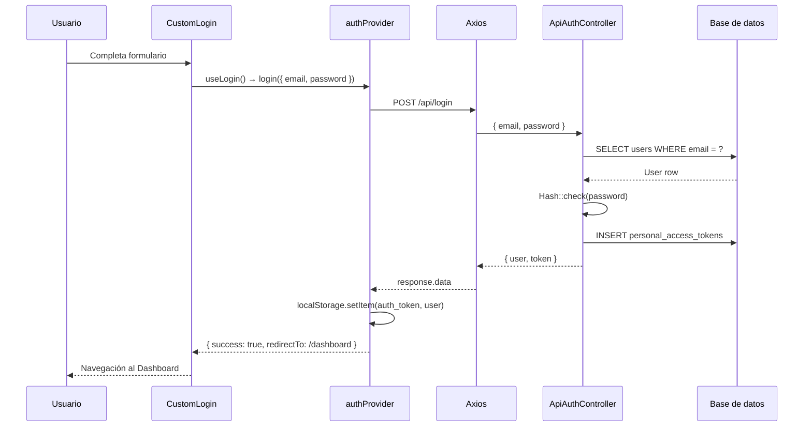

# Arquitectura de Login y Register (Autenticación)

> **Objetivo:** que cualquier desarrollador entienda el flujo completo de **inicio de sesión** y **registro de usuarios**: desde que el usuario completa el formulario en el navegador hasta que Laravel valida credenciales, crea o verifica el registro en la base de datos, emite un token Sanctum y el frontend redirige al Dashboard.
>
> Documentación relacionada: [`AppRouter-doc.md`](./AppRouter-doc.md), [`dashboard-doc.md`](./dashboard-doc.md), [`Resources.md`](./Resources.md).

---

## Qué es el sistema de autenticación en este proyecto

La SPA (Single Page Application) de React **no usa sesiones web ni cookies de Laravel** para autenticarse. En su lugar, implementa autenticación **stateless con tokens Bearer** mediante **Laravel Sanctum**.

| Aspecto | Decisión del proyecto |
| :--- | :--- |
| Mecanismo | Token personal de Sanctum (`Bearer`) |
| Persistencia en cliente | `localStorage` (`auth_token`, `user`) |
| Endpoints | `POST /api/login`, `POST /api/register` (públicos) |
| Protección de API | Middleware `auth:sanctum` en `routes/api.php` |
| Framework frontend | Refine `authProvider` + hooks `useLogin` / `useRegister` |
| Vistas | `CustomLogin` y `CustomRegister` (Ant Design) |

> **Nota sobre Laravel Fortify:** el proyecto incluye Fortify (trait `TwoFactorAuthenticatable` en el modelo `User`, `FortifyServiceProvider`, tests en `tests/Feature/Auth/`). Sin embargo, las **vistas de Fortify están deshabilitadas** y la SPA **no consume las rutas de Fortify**. El flujo activo de la aplicación es el descrito en este documento: `CustomLogin` / `CustomRegister` → `ApiAuthController` → Sanctum.

---

## Vista general del flujo

```text
┌─────────────────────────────────────────────────────────────────────────┐
│  USUARIO (navegador)                                                    │
│  /login  o  /register                                                   │
└───────────────────────────────┬─────────────────────────────────────────┘
                                │
┌───────────────────────────────▼─────────────────────────────────────────┐
│  FRONTEND — React                                                       │
│  CustomLogin / CustomRegister → useLogin / useRegister                  │
│  → authProvider.login / authProvider.register                           │
│  → axiosInstance.post('/api/login' | '/api/register')                   │
└───────────────────────────────┬─────────────────────────────────────────┘
                                │ JSON: { email, password, ... }
                                │ Sin header Authorization (rutas públicas)
┌───────────────────────────────▼─────────────────────────────────────────┐
│  LARAVEL — routes/api.php                                               │
│  → ApiAuthController@login  |  ApiAuthController@register               │
│  → Validación de request                                                │
│  → User::where / User::create + Hash::make                              │
│  → $user->createToken('auth_token')                                     │
└───────────────────────────────┬─────────────────────────────────────────┘
                                │ INSERT/SELECT en users + personal_access_tokens
┌───────────────────────────────▼─────────────────────────────────────────┐
│  BASE DE DATOS                                                          │
│  users | personal_access_tokens                                       │
└───────────────────────────────┬─────────────────────────────────────────┘
                                │ { user, token }
┌───────────────────────────────▼─────────────────────────────────────────┐
│  FRONTEND — Post-autenticación                                          │
│  localStorage.setItem('auth_token', token)                              │
│  localStorage.setItem('user', JSON.stringify(user))                     │
│  redirectTo: '/dashboard'                                               │
│  Interceptor Axios adjunta Bearer en peticiones futuras                 │
└─────────────────────────────────────────────────────────────────────────┘
```

---

## Capa 1: Arranque y rutas públicas

### Cadena desde el servidor

```text
[1] Usuario visita /login o /register
[2] Laravel (routes/web.php) devuelve view('app') para cualquier URL
[3] Vite carga resources/js/app.tsx → renderiza <AppRouter />
[4] React Router resuelve la ruta pública (sin layout administrativo)
[5] Se monta CustomLogin o CustomRegister
```

### Rutas públicas en React Router

Archivo: `resources/js/AppRouter.tsx`.

```tsx
<Route path="/login" element={<CustomLogin />} />
<Route path="/register" element={<CustomRegister />} />
```

Estas rutas están **fuera** de `ThemedLayout` (no muestran sidebar ni header del panel). Son accesibles sin token.

### Rutas públicas en Laravel API

Archivo: `routes/api.php`.

```php
// Rutas públicas de autenticación
Route::post('/login', [ApiAuthController::class, 'login']);
Route::post('/register', [ApiAuthController::class, 'register']);
```

| Ruta | Método | Middleware | Controlador |
| :--- | :--- | :--- | :--- |
| `/api/login` | POST | Ninguno (pública) | `ApiAuthController@login` |
| `/api/register` | POST | Ninguno (pública) | `ApiAuthController@register` |

Las rutas protegidas (`logout`, `me`, y todos los CRUD) están dentro de `Route::middleware('auth:sanctum')->group(...)`.

---

## Capa 2: Vistas de Login y Register

### CustomLogin

Archivo: `resources/js/components/auth/CustomLogin.tsx`.

#### Responsabilidades

- Renderizar formulario con email y contraseña.
- Validar campos en el cliente antes de enviar.
- Invocar `useLogin()` de Refine al enviar el formulario.
- Mostrar enlace a `/register`.
- Mostrar credenciales de prueba del administrador.

#### Flujo del formulario

```text
[1] Usuario completa email + password
[2] Ant Design Form valida reglas locales (required, type: email)
[3] onFinish(values) → login(values)
[4] useLogin internamente llama authProvider.login({ email, password })
[5] Si success → Refine navega a redirectTo: '/dashboard'
[6] Si error → Refine muestra notificación con mensaje de error
```

#### Validación en frontend (Login)

| Campo | Reglas Ant Design Form |
| :--- | :--- |
| `email` | `required`, `type: 'email'` |
| `password` | `required` |

El formulario de login **no aplica** la regex estricta de contraseña en el cliente (solo indica los requisitos como texto informativo). La validación de formato de contraseña ocurre principalmente en registro y en el CRUD de usuarios.

#### Credenciales de prueba

El componente muestra un `Alert` con la cuenta del seeder:

| Campo | Valor |
| :--- | :--- |
| Email | `admin@restaurante.com` |
| Contraseña | `Grecia-123` |

Origen: `database/seeders/UserSeeder.php` (rol `admin`, status `active`).

---

### CustomRegister

Archivo: `resources/js/components/auth/CustomRegister.tsx`.

#### Responsabilidades

- Formulario de registro con nombre, apellido, email y contraseña.
- Validación estricta de contraseña en el cliente.
- Invocar `useRegister()` de Refine.
- Enlace de vuelta a `/login`.

#### Validación en frontend (Register)

| Campo | Reglas Ant Design Form |
| :--- | :--- |
| `name` | `required` |
| `last_name` | `required` |
| `email` | `required`, `type: 'email'` |
| `password` | `required`, `min: 8`, `max: 16`, regex con mayúscula + número + carácter especial |

Regex del frontend:

```regex
^(?=.*[A-Z])(?=.*\d)(?=.*[@$!%*?&#\-_.])[A-Za-z\d@$!%*?&#\-_.]+$
```

---

## Capa 3: authProvider (Refine)

Archivo: `resources/js/AppRouter.tsx` (objeto `authProvider`).

Refine centraliza toda la lógica de sesión en este objeto. Los hooks `useLogin`, `useRegister`, `useLogout`, `useGetIdentity` y la protección de rutas dependen de él.

### Método `login`

```ts
login: async ({ email, password }) => {
    const response = await axiosInstance.post(`${API_URL}/login`, { email, password });

    if (response.data?.token) {
        localStorage.setItem('auth_token', response.data.token);
        localStorage.setItem('user', JSON.stringify(response.data.user));
        return { success: true, redirectTo: '/dashboard' };
    }
    // En caso de error HTTP → { success: false, error: { ... } }
}
```

| Paso | Acción |
| :--- | :--- |
| 1 | `POST /api/login` con `{ email, password }` |
| 2 | Guardar `token` y `user` en `localStorage` |
| 3 | Retornar `redirectTo: '/dashboard'` |
| 4 | En error (401/422) → mensaje "Credenciales inválidas" |

### Método `register`

```ts
register: async ({ name, last_name, email, password }) => {
    const response = await axiosInstance.post(`${API_URL}/register`, {
        name, last_name, email, password,
    });
    // Misma lógica de guardado y redirect que login
}
```

| Paso | Acción |
| :--- | :--- |
| 1 | `POST /api/register` con los 4 campos |
| 2 | Guardar token y user en `localStorage` |
| 3 | Redirigir a `/dashboard` |
| 4 | En error → muestra `error.response.data.message` si existe |

### Método `logout`

Invocado desde el `Header` (`useLogout()`):

```text
[1] POST /api/logout (con Bearer token)
[2] ApiAuthController borra el token actual en BD
[3] localStorage.removeItem('auth_token')
[4] localStorage.removeItem('user')
[5] redirectTo: '/'
```

### Método `check`

Se ejecuta en cada navegación a rutas protegidas:

```ts
check: async () => {
    const token = localStorage.getItem('auth_token');
    if (token) return { authenticated: true };
    return { authenticated: false, logout: true, redirectTo: '/login' };
}
```

> **Importante:** `check` solo verifica la **existencia** del token en `localStorage`. No valida el token contra el servidor en cada navegación. La validación real ocurre cuando una petición API recibe **401**, activando `onError` → logout forzado.

### Método `getIdentity`

Usado por el `Header` para mostrar nombre y avatar:

```text
[1] Lee user desde localStorage
[2] Si no existe, intenta GET /api/me
[3] Retorna objeto user o null
```

### Método `onError`

```ts
onError: async (error) => {
    if (error.response?.status === 401) {
        return { logout: true };
    }
}
```

Cualquier petición CRUD o de dashboard que reciba 401 provoca cierre de sesión automático.

---

## Capa 4: Cliente HTTP (Axios)

### Configuración

```ts
const API_URL = '/api';
const axiosInstance = axios.create();

axiosInstance.interceptors.request.use((request) => {
    const token = localStorage.getItem('auth_token');
    if (token) {
        request.headers['Authorization'] = `Bearer ${token}`;
    }
    return request;
});
```

| Petición | ¿Lleva Bearer? |
| :--- | :--- |
| `POST /api/login` | No (aún no hay token) |
| `POST /api/register` | No |
| `POST /api/logout` | Sí |
| `GET /api/me` | Sí |
| Cualquier CRUD (`/api/users`, etc.) | Sí |

---

## Capa 5: ApiAuthController (Laravel)

Archivo: `app/Http/Controllers/ApiAuthController.php`.

### `login(Request $request)`

```text
[1] Validar: email (required|email), password (required)
[2] User::where('email', $request->email)->first()
[3] Hash::check($request->password, $user->password)
[4] Si falla → ValidationException (422) con mensaje en español
[5] $token = $user->createToken('auth_token')->plainTextToken
[6] return JSON { user, token }
```

#### Validación backend (Login)

```php
$request->validate([
    'email' => 'required|email',
    'password' => 'required',
]);
```

| Regla | Descripción |
| :--- | :--- |
| `email` required + email | Formato válido obligatorio |
| `password` required | No valida longitud ni regex aquí |

#### Verificación de credenciales

```php
if (! $user || ! Hash::check($request->password, $user->password)) {
    throw ValidationException::withMessages([
        'email' => ['Las credenciales proporcionadas son incorrectas.'],
    ]);
}
```

- Busca por email en tabla `users`.
- Compara contraseña en texto plano contra el hash almacenado (`password` column).
- El modelo `User` tiene cast `'password' => 'hashed'`, pero `Hash::check` funciona con el valor crudo de la columna.

---

### `register(Request $request)`

```text
[1] Validar campos de entrada
[2] User::create([...]) con valores por defecto de rol y estado
[3] Hash::make($request->password) para la contraseña
[4] $token = $user->createToken('auth_token')->plainTextToken
[5] return JSON { user, token } con HTTP 201
```

#### Validación backend (Register)

```php
$request->validate([
    'name' => 'required|string|max:255',
    'last_name' => 'required|string|max:255',
    'email' => 'required|string|email|max:255|unique:users',
    'password' => 'required|string|min:8',
]);
```

| Campo | Reglas API Register | Reglas User::rules() (CRUD) |
| :--- | :--- | :--- |
| `name` | required, max:255 | required, max:255 |
| `last_name` | required, max:255 | required, max:255 |
| `email` | required, unique:users | required, unique (create) |
| `password` | required, min:8 | required, min:8, max:16, regex estricta, confirmed |

> **Diferencia clave:** el endpoint `/api/register` tiene validación de contraseña **más permisiva** (solo `min:8`) que el CRUD de usuarios (`User::rules()`). El frontend de registro sí aplica la regex estricta, pero el backend de la API no la exige. Un cliente API externo podría registrar contraseñas sin mayúsculas ni caracteres especiales.

#### Valores asignados al crear usuario

```php
User::create([
    'name' => $request->name,
    'last_name' => $request->last_name,
    'email' => $request->email,
    'password' => Hash::make($request->password),
    'role' => 'employee',      // Siempre empleado
    'status' => 'active',      // Siempre activo
    'registration_date' => now(),
]);
```

| Campo | Valor en registro público | Notas |
| :--- | :--- | :--- |
| `role` | `'employee'` | No se puede elegir rol desde el formulario público |
| `status` | `'active'` | Acceso inmediato al panel |
| `phone_number` | `null` | No se pide en el formulario |
| `registration_date` | `now()` | Timestamp de alta |

---

### `logout(Request $request)`

```php
$request->user()->currentAccessToken()->delete();
return response()->json(['message' => 'Sesión cerrada correctamente']);
```

- Requiere middleware `auth:sanctum`.
- Elimina **solo el token actual** de `personal_access_tokens` (no todos los tokens del usuario).
- El frontend limpia `localStorage` independientemente de si la petición falla.

---

### `me(Request $request)`

```php
return response()->json($request->user());
```

- Requiere `auth:sanctum`.
- Devuelve el modelo `User` autenticado (sin campos `hidden`: password, 2FA, remember_token).

---

## Capa 6: Modelo User

Archivo: `app/Models/User.php`.

### Traits relevantes para autenticación

```php
use HasApiTokens, HasFactory, Notifiable, TwoFactorAuthenticatable;
```

| Trait | Paquete | Función |
| :--- | :--- | :--- |
| `HasApiTokens` | Laravel Sanctum | `createToken()`, relación con `personal_access_tokens` |
| `TwoFactorAuthenticatable` | Laravel Fortify | 2FA (infraestructura; no usada por la SPA actual) |
| `Notifiable` | Laravel | Notificaciones por email |

### Campos fillable

```php
protected $fillable = [
    'name', 'last_name', 'email', 'email_verified_at', 'password',
    'phone_number', 'address', 'profile_picture',
    'role', 'status', 'registration_date', 'last_connection',
];
```

### Campos ocultos en JSON

```php
protected $hidden = [
    'password', 'two_factor_secret', 'two_factor_recovery_codes', 'remember_token',
];
```

El token y el objeto `user` que recibe el frontend **nunca incluyen la contraseña**.

### Casts

```php
'password' => 'hashed',
'registration_date' => 'datetime',
'last_connection' => 'datetime',
```

### Validaciones del modelo (CRUD, no Register API)

`User::rules()` y `User::messages()` se usan en `UserController@store` y `@update`, **no** en `ApiAuthController@register`.

Reglas de contraseña en CRUD:

```php
'password' => [
    'required',           // o 'nullable' en update
    'string', 'min:8', 'max:16',
    'regex:/^(?=.*[A-Z])(?=.*\d)(?=.*[@$!%*?&#\-_.])[A-Za-z\d@$!%*?&#\-_.]+$/',
    'confirmed',
],
```

---

## Capa 7: Laravel Sanctum

### Migración `personal_access_tokens`

Archivo: `database/migrations/2026_04_14_173557_create_personal_access_tokens_table.php`.

| Columna | Tipo | Descripción |
| :--- | :--- | :--- |
| `id` | bigint PK | Identificador del token |
| `tokenable_type` | string | `App\Models\User` |
| `tokenable_id` | bigint | FK al usuario |
| `name` | text | `'auth_token'` (nombre dado en `createToken`) |
| `token` | string(64) unique | Hash SHA-256 del token (el cliente recibe el valor plano una sola vez) |
| `abilities` | text nullable | Permisos del token |
| `last_used_at` | timestamp nullable | Último uso |
| `expires_at` | timestamp nullable | Expiración opcional |

### Creación del token

```php
$token = $user->createToken('auth_token')->plainTextToken;
```

```text
[1] INSERT en personal_access_tokens (tokenable = User)
[2] plainTextToken = "<id>|<random_string>" (enviado al cliente)
[3] En BD se guarda solo el hash del random_string
```

### Configuración

Archivo: `config/sanctum.php`.

| Opción | Valor | Efecto |
| :--- | :--- | :--- |
| `expiration` | `null` | Los tokens **no expiran** por defecto |
| `guard` | `['web']` | Sanctum intenta guard web primero; si no hay sesión, usa Bearer |

### Middleware `auth:sanctum`

Cuando llega `Authorization: Bearer <token>`:

```text
[1] Sanctum extrae el token del header
[2] Busca hash en personal_access_tokens
[3] Resuelve tokenable_id → modelo User
[4] $request->user() queda autenticado para el resto del request
```

---

## Capa 8: Base de datos

### Tabla `users`

Migración: `database/migrations/0001_01_01_000000_create_users_table.php`.

| Columna | Tipo | Rol en autenticación |
| :--- | :--- | :--- |
| `id` | bigint PK | Identificador del usuario |
| `name` | string(100) | Nombre (registro) |
| `last_name` | string(100) | Apellido (registro) |
| `email` | string(100) unique | Login (búsqueda) + registro (unicidad) |
| `password` | string | Hash bcrypt/argon |
| `role` | enum(admin, employee, client) | Asignado en registro: `employee` |
| `status` | enum(active, inactive) | Asignado en registro: `active` |
| `registration_date` | timestamp | Fecha de alta |
| `email_verified_at` | timestamp nullable | Verificación de email (no implementada en SPA) |
| `two_factor_secret` | text nullable | Infraestructura Fortify 2FA |
| `remember_token` | string nullable | Sesiones web (no usadas por SPA) |

La misma migración crea tablas auxiliares:

| Tabla | Uso en este proyecto |
| :--- | :--- |
| `password_reset_tokens` | Reset de contraseña (Fortify, no SPA) |
| `sessions` | Sesiones web Laravel (no SPA) |

### Tabla `personal_access_tokens`

Almacena los tokens Bearer activos. Cada login o registro exitoso inserta un nuevo registro.

---

## Flujo completo: Login (ejemplo)

```text
[1] USUARIO
    Abre http://localhost/login
    Ingresa: admin@restaurante.com / Grecia-123
    Clic en "Entrar al Sistema"

[2] FRONTEND — CustomLogin
    Form valida email + password requeridos
    useLogin() → authProvider.login({ email, password })

[3] HTTP
    POST /api/login
    Body: { "email": "admin@restaurante.com", "password": "Grecia-123" }
    Sin Authorization header

[4] LARAVEL — ApiAuthController@login
    Valida email y password presentes
    SELECT * FROM users WHERE email = 'admin@restaurante.com'
    Hash::check('Grecia-123', $user->password) → true
    INSERT INTO personal_access_tokens (tokenable_id=1, name='auth_token', ...)
    Respuesta: { "user": { id, name, email, role, ... }, "token": "1|abc..." }

[5] FRONTEND — authProvider
    localStorage.auth_token = "1|abc..."
    localStorage.user = '{"id":1,"name":"Admin",...}'
    redirectTo: '/dashboard'

[6] NAVEGACIÓN
    React Router → /dashboard
    authProvider.check() → authenticated: true
    ThemedLayout + CustomDashboard

[7] PETICIONES POSTERIORES
    GET /api/users → Header: Authorization: Bearer 1|abc...
    auth:sanctum valida token → User autenticado
```

---

## Flujo completo: Register (ejemplo)

```text
[1] USUARIO
    Abre /register
    Completa: name, last_name, email, password (con mayúscula, número, especial)
    Clic en "Registrarse"

[2] FRONTEND — CustomRegister
    Form valida todos los campos + regex de contraseña
    useRegister() → authProvider.register({ name, last_name, email, password })

[3] HTTP
    POST /api/register
    Body: { "name": "Pedro", "last_name": "Ruiz", "email": "pedro@test.com", "password": "MiPass-1" }

[4] LARAVEL — ApiAuthController@register
    Valida campos (email unique, password min:8)
    INSERT INTO users (
        name='Pedro', last_name='Ruiz', email='pedro@test.com',
        password=<hash>, role='employee', status='active',
        registration_date=NOW()
    )
    INSERT INTO personal_access_tokens
    Respuesta 201: { user, token }

[5] FRONTEND
    Guarda token y user en localStorage
    Redirige a /dashboard (mismo flujo que login)
```

---

## Flujo completo: Logout

```text
[1] USUARIO
    Clic en avatar del Header → "Cerrar Sesión"

[2] FRONTEND — Header
    useLogout() → authProvider.logout()

[3] HTTP
    POST /api/logout
    Header: Authorization: Bearer <token>

[4] LARAVEL
    auth:sanctum identifica usuario
    DELETE token actual en personal_access_tokens

[5] FRONTEND
    Limpia localStorage (auth_token, user)
    Redirige a / (HomePage)
```

---

## Manejo de errores

| Escenario | HTTP | Respuesta / Comportamiento frontend |
| :--- | :--- | :--- |
| Email no existe o password incorrecta | 422 | Login: "Credenciales inválidas" |
| Email duplicado en registro | 422 | Register: mensaje de validación Laravel |
| Password < 8 en registro (API) | 422 | Errores de validación |
| Petición sin token a ruta protegida | 401 | `onError` → logout automático |
| Token revocado (logout previo) | 401 | Mismo comportamiento |
| Logout con token ya inválido | 401/error | Frontend ignora error y limpia localStorage |

---

## Protección de rutas en el frontend

El proyecto **no usa** un componente `<Authenticated>` explícito de Refine. La protección funciona así:

```text
[1] Rutas CRUD y /dashboard están dentro de ThemedLayout
[2] Refine ejecuta authProvider.check() al navegar
[3] Sin token → redirectTo: '/login'
[4] Con token → renderiza la ruta solicitada
[5] Si el token es inválido en servidor → 401 en cualquier fetch → logout
```

Rutas siempre públicas: `/`, `/login`, `/register`, `/proximamente`.

---

## Comparación: Login/Register vs CRUD de Usuarios

| Aspecto | Login / Register (API pública) | CRUD Users (API protegida) |
| :--- | :--- | :--- |
| Controlador | `ApiAuthController` | `UserController` |
| Autenticación requerida | No | Sí (`auth:sanctum`) |
| Validación | Inline en controlador | `User::rules()` + `User::messages()` |
| Rol asignado | Fijo: `employee` | Se elige en formulario (`admin`, `employee`, `client`) |
| Password confirm | No | Sí (`confirmed`) |
| Respuesta | `{ user, token }` | JSON del usuario (sin token) |
| Endpoint | `POST /api/login`, `/api/register` | `POST /api/users` |

---

## Datos de prueba (Seeder)

Archivo: `database/seeders/UserSeeder.php`.

Crea el usuario administrador y varios clientes de ejemplo. Todos comparten la contraseña `Grecia-123` (hasheada con `Hash::make`).

| Email | Rol | Status |
| :--- | :--- | :--- |
| `admin@restaurante.com` | admin | active |
| `juan@example.com` | client | active |
| `carlos@example.com` | client | inactive |
| ... | client | active |

Para probar login:

```bash
php artisan migrate --seed
```

Luego iniciar sesión con `admin@restaurante.com` / `Grecia-123`.

---

## Archivos clave (referencia rápida)

| Capa | Archivo |
| :--- | :--- |
| Vista Login | `resources/js/components/auth/CustomLogin.tsx` |
| Vista Register | `resources/js/components/auth/CustomRegister.tsx` |
| authProvider + Axios | `resources/js/AppRouter.tsx` |
| Logout UI | `resources/js/components/header/index.tsx` |
| Rutas API | `routes/api.php` |
| Controlador | `app/Http/Controllers/ApiAuthController.php` |
| Modelo | `app/Models/User.php` |
| Config Sanctum | `config/sanctum.php` |
| Config Auth | `config/auth.php` |
| Migración users | `database/migrations/0001_01_01_000000_create_users_table.php` |
| Migración tokens | `database/migrations/2026_04_14_173557_create_personal_access_tokens_table.php` |
| Seeder | `database/seeders/UserSeeder.php` |
| Destino post-login | [`dashboard-doc.md`](./dashboard-doc.md) |

---

## Diagrama de secuencia (Login)



---

## Notas para futuras mejoras

1. **Unificar validación de contraseña** entre `ApiAuthController@register` y `User::rules()` para evitar discrepancias frontend/backend.
2. **Validar token en `check()`** con `GET /api/me` periódicamente si se requiere mayor seguridad.
3. **Control de roles en frontend:** hoy `getPermissions` retorna `null`; un empleado registrado públicamente tiene el mismo acceso visual que un admin.
4. **Expiración de tokens:** configurar `expiration` en `config/sanctum.php` si se desea sesiones temporales.
5. **Fortify / 2FA:** la infraestructura existe pero no está integrada con el flujo Sanctum de la SPA.
